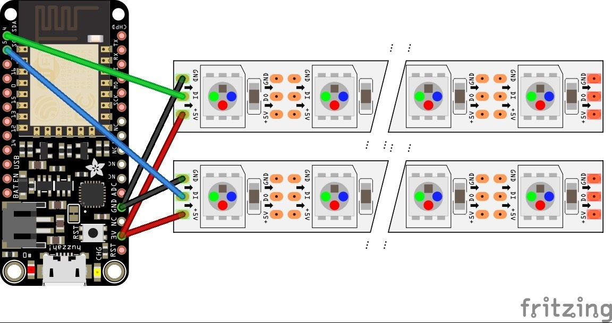
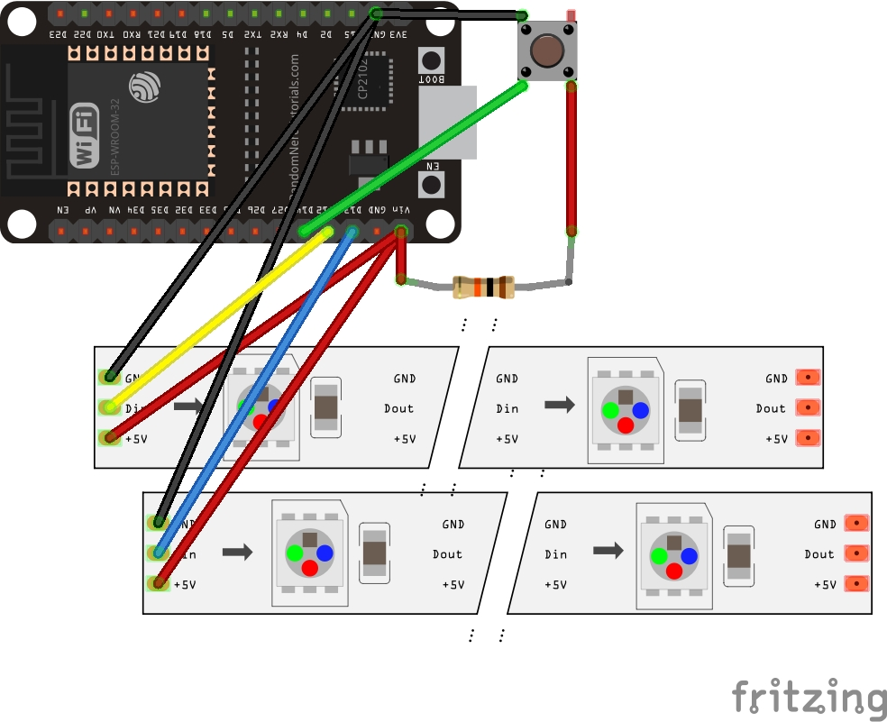
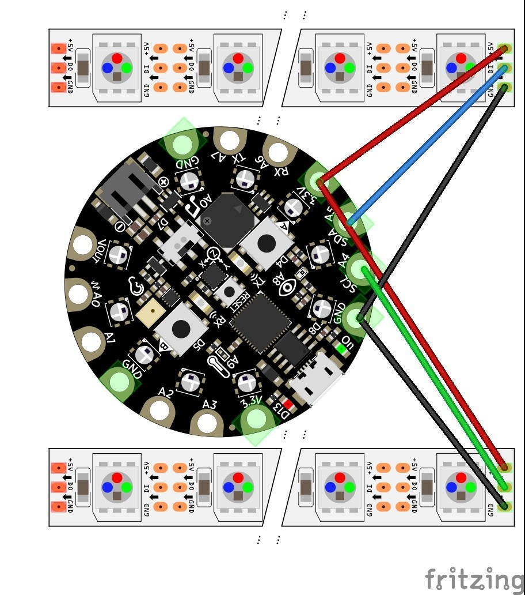

# Edge-Lit Rainbow
Updated code and design files for Edge Lit Rainbow project in Make: Vol. 69

When connected to WiFi and running the included Arduino code, the controller can connect to OpenWeatherMap to retrieve current temperature and weather conditions. If the conditions are sucessfully downloaded, every 30 seconds, the rainbow will display a solid color that maps to the current temperature, using the spectrum shown below:

The original instructions connected the rainbow to an Adafruit Huzzah ESP8266 microcontroller as shown below:

The rainbow may now be connected to an ESP32 or ESP8266 controller, with an optional push button to allow it to enter configuration mode:

CircuitPython code is also included to allow the Rainbow to be connected to an Adafruit Circuit Playground Express in an interactive mode:

# Configuration Mode

While it is attempting to connect to WiFi, the rainbow will cycle through lighting up each arc until it has successfully connected or until it enters configuration mode. If it connects successfully, it will display cycling rainbow pattern. When it enters configuration mode, all arcs of the rainbow will pulse red until the WiFi connection is configured, or until 90 seconds has passed. After 90 seconds, the normal rainbow pattern will start to display.

When running on an ESP32 or ESP8266 with the supplied Arduino code, the rainbow will enter configuration mode automatically on startup if it cannot connect to WiFi, either because it doesn't have stored SSID/Password or because the stored SSID/Password don't connect. You can also force the ESP into configuration mode at startup by grounding the button pin (easiest if you physically connect a button to the pin).

Once it is in configuration mode, you can configure the connection parameters by connecting to the local access point named "RainbowConnection". You will be directed to a configuration page like the one below:

(TBD)

# Update - July 19, 2020

The following changes have been added to the Arduino code:
- The code now runs on ESP32 as well as ESP8266 boards
- Code is added to support an optional push putton which starts the program in "Configuration Mode". In Configuration mode, the ESP board boots as a WiFi access point named "RainbowConnection". Logging int access point allows the user to configure the board to connect to local WiFi.
- The OpenWeatherMap LocationID and AppID are stored in spiffs and can be set through the Access Point when the ESP is in Configuration Mode
